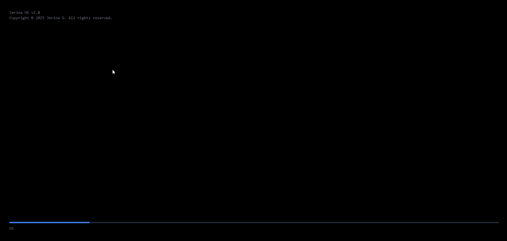
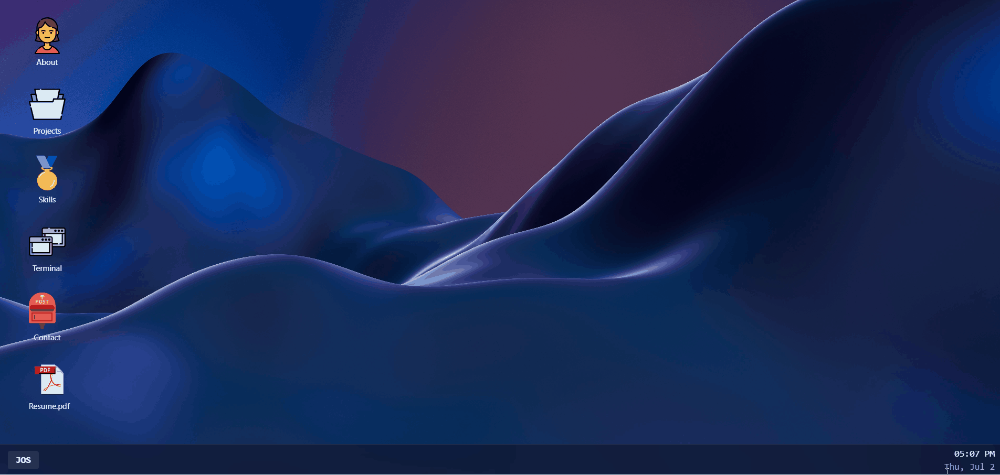

# Jerina OS — Desktop Portfolio

An interactive portfolio built to look and feel like a desktop operating system.
Boot it up, log in, drag the icons around, open windows, and type commands into a
working terminal.

🔗 **Live demo:** [portfolioappdesktopstyle.vercel.app](https://portfolioappdesktopstyle.vercel.app)

## Boot Sequence



## Draggable Desktop



## About

Instead of a traditional scrolling page, this portfolio recreates a full desktop
environment in the browser — a boot sequence, a login screen, a taskbar with a
live clock, draggable desktop icons, and windows you can open and focus like a
real OS.

## Features

- **Boot & login flow** — an animated BIOS-style boot screen followed by a
  click-to-enter login screen, both using Framer Motion transitions.
- **Draggable desktop icons** — grab any icon and drop it anywhere on the desktop.
- **Window system** — open multiple windows at once, each stacking and focusing
  independently, with macOS-style window controls.
- **About, Projects, Skills, Contact** — each opens in its own window, with the
  Skills window featuring custom radial skill charts built in pure SVG.
- **Interactive terminal** — a working command line with commands like `whoami`,
  `skills`, `projects`, and `contact`, plus a boot sequence, a blinking cursor,
  command history via the arrow keys, and a few hidden easter eggs.
- **Frosted taskbar** — shows open windows and a live clock, with the active
  window highlighted.
- **Resume download** — a desktop file icon that downloads the resume directly.

## Tech Stack

- **React 19** — UI and component architecture
- **Vite** — build tool and dev server
- **Tailwind CSS** — styling
- **Framer Motion** — drag interactions and screen transitions

## Running Locally

```bash
# clone the repo
git clone https://github.com/CodebyJerina/Portfolio-App-Desktop-Lookalike.git

# move into the project folder
cd Portfolio-App-Desktop-Lookalike/portfolioApp

# install dependencies
npm install

# start the dev server
npm run dev
```

Then open the local URL shown in the terminal (usually `http://localhost:5173`).

## Building for Production

```bash
npm run build
```

The optimized output is generated in the `dist` folder.

---

Built by Jerina G — Frontend Developer.
📧 inboxofjerina@gmail.com · 🐙 [github.com/CodebyJerina](https://github.com/CodebyJerina)